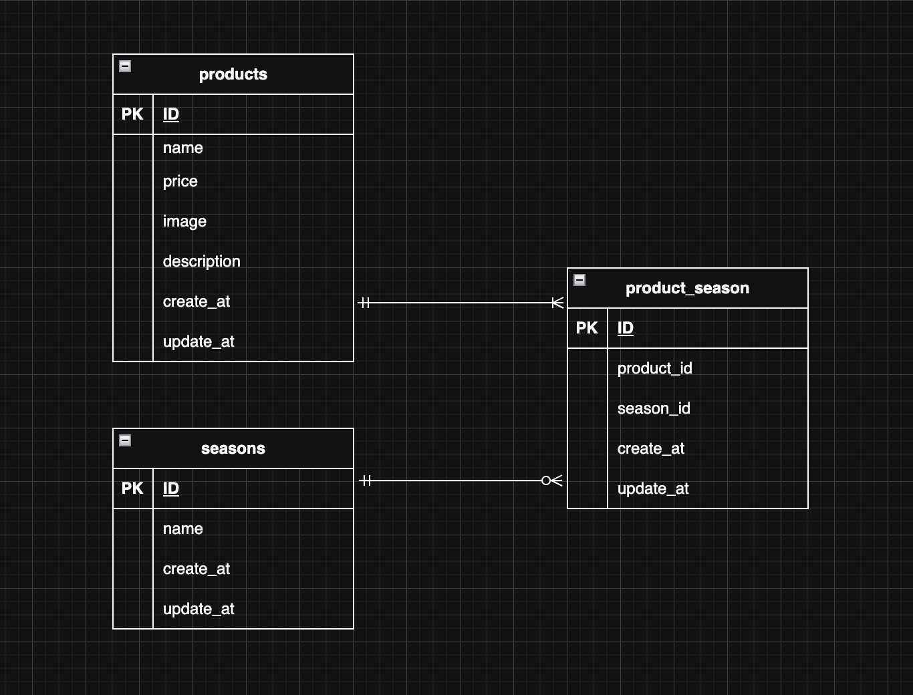

# mogitate  
## 環境構築  
### Dockerビルド  
・ターミナルを立ち上げ、下記を貼り付け実行  
```bash
git clone git@github.com:haruki-saitou/mogitate.git  
```  
・DockerDesktopアプリを立ち上げる  
・ターミナルに下記を貼り付け実行  
```bash
docker compose up -d --build  
```  
### laravel環境構築  
・PHPコンテナ内に入る  
```bash
docker compose exec php bash  
```
・composerインストール  
```bash
composer install  
```  
・.env.exampleファイルを.envとしてコピー 
```bash
cp .env.example .env  
```  
.envの以下の場所の内容を、以下の内容に変更  
```bash
DB_CONNECTION=mysql  
DB_HOST=mysql  
DB_PORT=3306  
DB_DATABASE=laravel_db  
DB_USERNAME=laravel_user  
DB_PASSWORD=laravel_pass  
```
・アプリケーションキーの作成  
```bash
php artisan key:generate  
```  
・マイグレーションの実行  
```bash
php artisan migrate  
```  
・ストレージリンク作成  
```bash
php artisan storage:link  
```  
・シーディングの実行  
```bash
php artisan db:seed  
```  
## 開発環境  
・商品一覧画面: http://localhost/products  
・商品詳細画面: http://localhost/products/detail/{product_id}  
・商品登録画面: http://localhost/products/register  
・phpMyAdmin: http://localhost:8080  
## 使用技術(実行環境)  
・Laravel 8.83.29  
・PHP 8.1.33  
・nginx 1.21.1  
・MySQL 8.0.44  
・jquery 3.7.1  
## ER図

